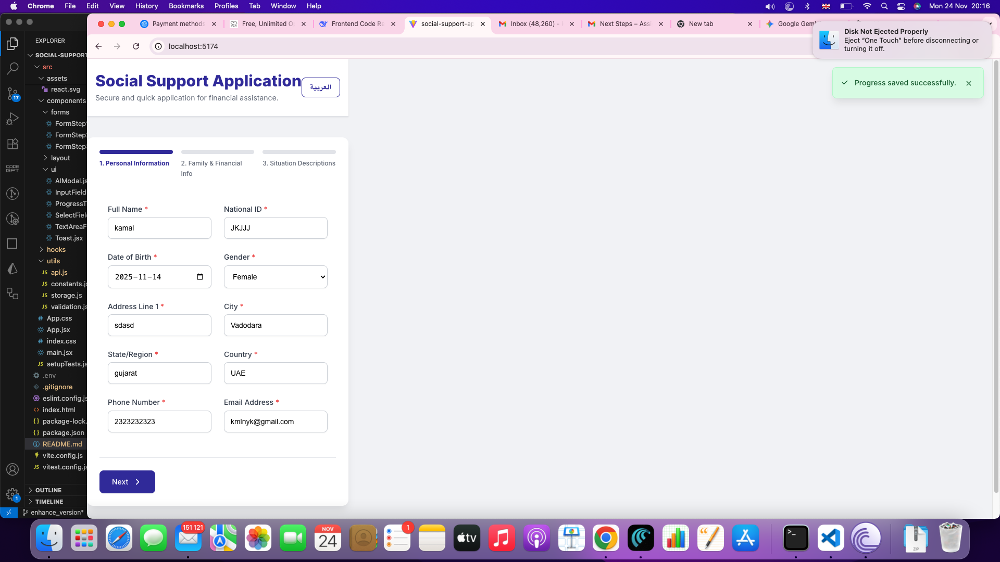
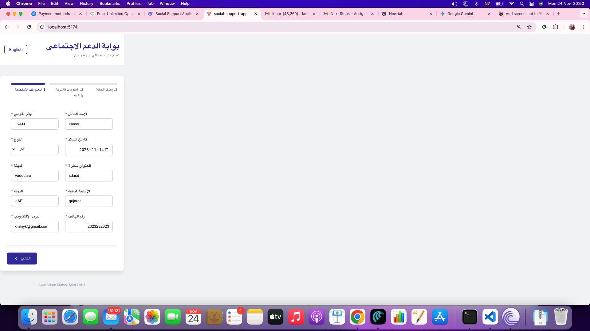

Social Support Application

A modern multi-step form application with AI-assisted writing for financial support requests.
Built using React, with internationalization (Arabic/RTL), form validation, auto-save, and AI integration (OpenAI / Gemini).

🌐 Demo Screenshots

(Add screenshots here)
## 📸 Screenshots

### Step 1 – English View

### Step 2 – Arabic RTL View

## Project URL
https://social-support-app-d5wff44ae-john5037s-projects.vercel.app/

🚀 Quick Start
Prerequisites

Node.js v16+

npm or yarn

API key for OpenAI or Google Gemini

📦 Installation
1. Clone the repository
git clone (https://github.com/john5037/social-support-app-ai.git)
git checkout master
cd social-support-app

npm install

2. Setup environment variables

Copy example env:

cp .env.example .env

Configure API keys (explained below).

3. Start development server
npm run dev

The app runs at:
👉 http://localhost:5173

🔑 API Configuration

You can choose one AI provider.

### Option 1: OpenAI (ChatGPT)

Get API key → OpenAI Platform.

Add to .env:

VITE_OPENAI_API_KEY=sk-your-key
VITE_AI_PROVIDER=openai

Option 2: Google Gemini

Get API key → Google AI Studio.

Add to .env:

VITE_GEMINI_API_KEY=your-gemini-key
VITE_AI_PROVIDER=gemini

⚙️ Environment Variables Reference
# Required: choose AI provider
VITE_AI_PROVIDER=openai  # or "gemini"

# OpenAI
VITE_OPENAI_API_KEY=your_openai_key
VITE_OPENAI_API_URL=https://api.openai.com/v1/chat/completions

# Gemini
VITE_GEMINI_API_KEY=your_gemini_key
VITE_GEMINI_API_URL=https://generativelanguage.googleapis.com/v1beta/models/gemini-pro:generateContent

# Optional
VITE_ENABLE_AI=true

🏗️ Architecture & Design
Folder Structure
src/
├── components/
│   ├── forms/        # Form steps (1–3)
│   └── ui/           # Reusable UI components
├── hooks/            # Custom hooks
├── utils/            # Validation, storage, API logic
└── assets/           # Styles, images, static files

🧩 Key Design Patterns
1. Custom Hooks

useForm → central form state + reducer + validation + localStorage auto-save

useLocalStorage → safe storage wrapper with error handling

2. Component Composition
<FormStep1
  data={formData}
  updateField={updateField}
  texts={texts}
  isRTL={isRTL}
  errors={errors}
/>

3. Internationalization (i18n)

RTL/LTR built into layout

Central text storage in constants.js

Dynamic language switching

4. AI Service Abstraction

Unified AI provider interface:

const suggestion = await generateAISuggestion(field, text, isRTL, texts);

🔄 Data Flow

State: driven by useReducer

Saving: auto-save with debounce → localStorage

Validation: step-based + field-level error messages

AI: async suggestions with loading UI

🎯 Features
[1]Core

✔ Multi-step wizard
✔ Progress tracking
✔ RTL/LTR language support
✔ Auto-save
✔ Form validation
✔ Responsive UI

[2]AI Capabilities

✔ “Help Me Write” text suggestions
✔ Supports OpenAI + Gemini
✔ User can edit suggestions before applying
✔ Loading/errors handled gracefully

User Experience

✔ Accessible UI (ARIA, keyboard navigation)
✔ Toast notifications
✔ Clean government-style design
✔ LocalStorage persistence

🔧 Development Scripts
npm run dev       # development
npm run build     # create production build
npm run preview   # preview build
npm run test     # Run test cases

📂 Detailed Project Structure
Components

Form Steps: structured per input category

UI Components: input fields, buttons, loaders

Layout: header, footer, progress bar

Utilities

Validation: per-field rules

Storage: safe persistent storage layer

API: retry logic + backoff for stability

🚀 Deployment
Build for production
npm run build

Ensure all environment variables are configured in your hosting platform.

📝 Improvement Opportunities
Immediate Enhancements

Add form analytics

Document upload support

Real-time validation

Full offline mode (service worker)

Technical Enhancements

Migrate to TypeScript

Add Jest/RTL unit tests

Add Error Boundaries

Bundle optimization and monitoring

🤝 Contributing

Follow component patterns & prop interfaces

Maintain RTL compatibility

Use centralized constants for text

Ensure accessibility (WCAG compliant)

📄 License

Add your license here.